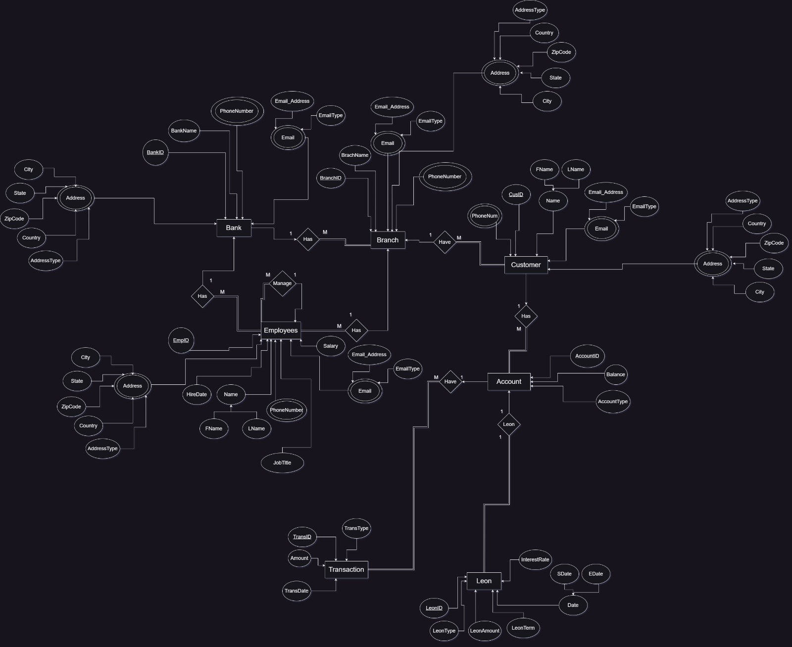

# Bank Database

The Bank Database is a database designed to store information related to a banking system. It includes tables for storing information about banks, branches, employees, customers, accounts, transactions, loans, and email addresses, along with various mappings between these entities. The database schema includes several relationships between tables, providing a framework for storing and accessing data related to a banking system.
Getting Started

To use the Bank Database, you will need to have a database management system installed on your computer, such as MySQL or PostgreSQL. Once you have a database management system installed, you can create a new database and import the SQL file provided in this repository to create the necessary tables and relationships.
Database Schema

# The Bank Database includes the following tables:

    Address
    Bank
    Branch
    Customer
    Email
    Customer_Email
    Account
    Transaction
    Loan
    Employee

The relationships between these tables are described in detail in the database documentation.

# ERD

# Mapping

# Contributing

If you would like to contribute to the Bank Database, please fork the repository and submit a pull request. All contributions are welcome, including bug fixes, new features, and improvements to the documentation.

# License

The Bank Database is released under the SVU License. See LICENSE for more information.

# Contact

If you have any questions or feedback about the Bank Database, please feel free to contact us at [y4ssermoh4med@gmail.com]
